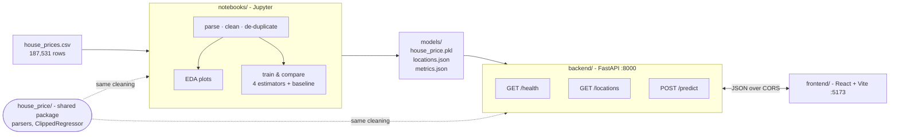
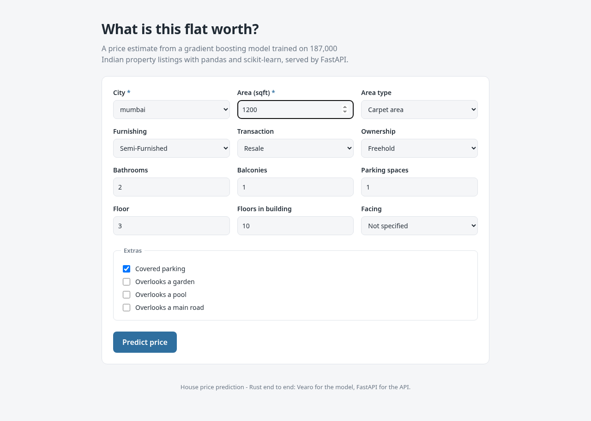
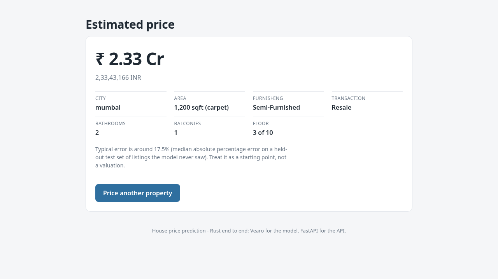

# House Price Prediction

Guesses what a flat or house in India is worth from its city, floor area, layout and condition.
Trained in a Jupyter notebook on 187,531 real listings, served by FastAPI, with a React form on top.

Stack: pandas, scikit-learn, Jupyter, FastAPI, React + TypeScript + Vite.

There's a sibling repo, [`house-price-app`](https://github.com/razecrs/house-price-app), that does
the same thing in Rust with no Python at all, using
[Vearo](https://github.com/razecrs/vearo) for the model. The two agree on the data down to the row,
see [Cross-check](#cross-check).

## Results

Gradient boosting, trained on `log1p(price)`, scored once on a held-out test split of 12,530
listings it never saw:

| model | MAE | RMSE | R² | MdAPE | pickle | fit |
|---|---|---|---|---|---|---|
| *Rate card (city median rate × area), no model* | *₹32.41 Lac* | *₹71.87 Lac* | *0.647* | *24.1%* | – | – |
| Linear regression | ₹27.15 Lac | ₹61.05 Lac | 0.745 | 20.6% | 0.0 MB | 1.0s |
| MLP 128-64 | ₹25.98 Lac | ₹61.26 Lac | 0.744 | 19.5% | 0.6 MB | 19.8s |
| **Gradient boosting**, exported | **₹23.01 Lac** | **₹49.72 Lac** | **0.831** | **17.5%** | 1.5 MB | 3.6s |
| Random forest | ₹23.64 Lac | ₹50.53 Lac | 0.826 | 17.3% | 393.7 MB | 16.9s |
| Gradient boosting, raw target | ₹24.76 Lac | ₹51.16 Lac | 0.821 | 20.1% | 0.6 MB | 1.7s |

Five-fold cross validation gives mean R² **0.816** (sd 0.016), so the single split isn't a lucky one.

The brief suggests trying both a log target and a raw one. Same estimator and seed, only the target
changes, and the log version is 2.6 points better on MdAPE. Squared error on raw rupees gets
dominated by the expensive listings, so the raw model spends its effort there and gets worse at
everything else.

### The brief's log-target tip has a bias in it

The brief says to train on `log1p(y)` and invert with `expm1`. That does help, but the two steps
don't cancel and it doesn't say so.

Least squares in log space fits `E[log y | x]`, the mean of the log. Exponentiating that gives back
the **median** of y, not the mean, because `exp` is convex and Jensen's inequality says
`exp(E[log y]) <= E[y]`. Every prediction lands low and training longer doesn't fix it, because the
model is doing exactly what it was asked.

It's measurable on this data:

| | MAE | RMSE | R² | MdAPE | predicted total vs actual |
|---|---|---|---|---|---|
| the tip as written | ₹23.01 Lac | ₹49.72 Lac | 0.831 | 17.5% | **0.953** |
| Duan smearing | ₹23.20 Lac | ₹49.17 Lac | 0.835 | 18.2% | 0.990 |
| parametric, exp(σ²/2) | ₹23.19 Lac | ₹49.18 Lac | 0.835 | 18.2% | 0.989 |

Look at the last column. Written as the brief has it, the model predicts a total **4.7% under** the
real total. [Duan's smearing estimator](https://doi.org/10.2307/2288126) fixes it: take the training
residuals in log space, average `exp` of them, scale by that. It lands within 1%. The parametric
version `exp(σ²/2)` agrees to 0.001, which says the residuals really are close to lognormal.

It's a trade rather than a free win. Uncorrected gives the conditional median, which is what
minimises absolute and percentage error, so it wins MAE and MdAPE. Smeared gives the conditional
mean, which minimises squared error and is the only one that adds up correctly over a set of
properties, so it wins RMSE and R². Pricing one flat, which is what the app does, the median is the
better answer, so that's what ships. Valuing a thousand flats, you want the smeared one.

`SmearedRegressor` in `house_price/model.py` does either.

**MdAPE** (median absolute percentage error) is the one to look at. Prices cover two orders of
magnitude, so an MAE in rupees is dominated by a few very expensive listings. MdAPE tells you how
wrong a normal prediction is.

**Random forest is 0.2pp better and 260x bigger.** I fixed the rule before looking at the numbers:
best MdAPE wins, anything within half a point counts as tied, and the smallest file among the ties
takes it. A 394 MB pickle can't be committed anyway since the brief caps a versioned model at
50 MB, and paying that for 0.2pp would be a bad trade even if it could.

### Two things worth writing down

**1. 61% of this dataset is duplicate rows.** One advert shows up 821 times. They get removed
before the split, because a listing in both halves turns the test set into a memory test:

| test split | MdAPE | R² |
|---|---|---|
| duplicates left in | 3.4% | 0.929 |
| de-duplicated (this project) | 17.5% | 0.831 |

The first row is the nicer number and the useless one.

**2. One prediction out of 12,530 was setting the headline metric.** Training on `log1p(price)` and
undoing it with `expm1` turns a small error in log space into a huge one in rupees at the top of the
range. Without clipping, the MLP returned ₹300 Cr for a flat worth ₹16 Cr, and that one row dragged
its R² from 0.744 to **−3.638** while the median error stayed at a perfectly fine 19.5%.
`ClippedRegressor` caps predictions at the price range seen during fitting, since the model has no
business predicting eight times more than anything it was shown. It's inside the pickle so the API
gets it too.

## Cross-check

The same cleaning rules are implemented independently in Python here and in Rust in the sibling
repository. They agree exactly:

| step | Python | Rust |
|---|---|---|
| raw rows | 187,531 | 187,531 |
| no usable price | −9,684 | −9,684 |
| no usable area | −90 | −90 |
| duplicate listings | −113,886 | −113,886 |
| price-per-sqft outliers | −1,225 | −1,225 |
| **kept** | **62,646** | **62,646** |

Two separate implementations landing on the same five numbers from 187,531 messy rows is a much
better check on the parsers than either one's unit tests.

Model scores differ slightly because the two split the data with different random number generators,
and because the estimators differ. Notably the Vearo MLP (17.9% MdAPE, R² 0.831) beats
scikit-learn's `MLPRegressor` here (19.5%, 0.744) and matches this project's gradient boosting on R².

## Architecture



`house_price/` is the important bit. The parsers and the clipping wrapper live there and both the
notebook and the API import them, so a listing can't get cleaned one way in training and another in
production. Everything after cleaning (imputing, scaling, one-hot, the log target) is inside the
exported `Pipeline`, so the API doesn't encode anything itself.

## Project structure

```
.
├── house_price/                # shared package, imported by the notebook and the backend
│   ├── cleaning.py             # parse_amount, parse_area_sqft, parse_floor, build_frame, ...
│   └── model.py                # ClippedRegressor
├── notebooks/
│   ├── house_price_model.ipynb # the whole analysis, runs top to bottom
│   └── data/                   # gitignored, see Dataset below
├── backend/
│   ├── app/
│   │   ├── main.py             # FastAPI app, CORS, model loaded in the lifespan
│   │   ├── api/routes/prediction.py
│   │   ├── core/config.py      # pydantic-settings, reads backend/.env
│   │   ├── schemas/prediction.py
│   │   └── services/{preprocessing,inference}.py
│   ├── tests/test_prediction.py
│   ├── requirements.txt
│   ├── .env.example
│   └── Dockerfile
├── frontend/                   # React + TypeScript + Vite
├── models/                     # house_price.pkl (1.5 MB), locations.json, metrics.json
├── reports/                    # plots saved by the notebook
└── pyproject.toml              # makes house_price importable from anywhere
```

## Setup

### Prerequisites

| Tool | Version | Check with |
|---|---|---|
| Python | 3.11+ | `python --version` |
| Node.js + npm | 18+ | `node --version` |
| Git | any recent | `git --version` |

### 1. Environment

```bash
python -m venv .venv
source .venv/bin/activate            # Windows: .venv\Scripts\activate
pip install -r requirements-dev.txt  # notebook + service
pip install -e .                     # makes `house_price` importable everywhere
```

`pip install -e .` is not optional: `backend/` imports `house_price`, and without it `uvicorn`
started from inside `backend/` cannot find the package.

### 2. Dataset

Only needed if you want to retrain. The trained model is committed so the API and frontend work without it.

```bash
mkdir -p notebooks/data
curl -L -o /tmp/house-price.zip \
  "https://www.kaggle.com/api/v1/datasets/download/juhibhojani/house-price"
unzip -o /tmp/house-price.zip -d notebooks/data
```

Source: [kaggle.com/datasets/juhibhojani/house-price](https://www.kaggle.com/datasets/juhibhojani/house-price)
(102 MB, 187,531 rows). Gitignored, so this repo doesn't redistribute it.

### 3. Notebook

```bash
jupyter lab notebooks/house_price_model.ipynb    # Kernel → Restart & Run All
```

Takes about a minute. Writes `models/` and `reports/`.

### 4. Backend

```bash
cp backend/.env.example backend/.env
cd backend && uvicorn app.main:app --reload       # http://localhost:8000
```

Swagger UI at <http://localhost:8000/docs>.

### 5. Frontend

```bash
cd frontend
cp .env.example .env
npm install
npm run dev                                       # http://localhost:5173
```

### Tests

```bash
pytest                       # 8 API tests against the real model
cd frontend && npm run build # type-checks and builds
```

## Environment variables

**`backend/.env`** (see `backend/.env.example`)

| Variable | Default | Purpose |
|---|---|---|
| `HOST` | `127.0.0.1` | Bind address |
| `PORT` | `8000` | Bind port |
| `MODEL_PATH` | `models/house_price.pkl` | Exported pipeline. Relative paths resolve from the repo root, not the cwd |
| `LOCATIONS_PATH` | `models/locations.json` | City list |
| `ALLOWED_ORIGIN` | `http://localhost:5173` | The one origin CORS permits |
| `LOG_LEVEL` | `INFO` | Log level |

**`frontend/.env`** (see `frontend/.env.example`)

| Variable | Default | Purpose |
|---|---|---|
| `VITE_API_BASE_URL` | `http://localhost:8000` | API base URL. Only `VITE_`-prefixed variables reach the browser. |

## API reference

### `GET /health`

```json
{ "status": "ok", "model_loaded": true, "model_name": "ClippedRegressor", "sklearn_version": "1.9.0" }
```

### `GET /locations`

The cities the model was trained on. The frontend's dropdown is populated from here, so it can never
offer a city the model does not know.

### `POST /predict`

| Field | Type | Required | Notes |
|---|---|---|---|
| `location` | string | yes | A city from `/locations` |
| `area_sqft` | number | yes | 0 < area ≤ 1,000,000 |
| `furnishing` | enum | no | `Furnished` / `Semi-Furnished` / `Unfurnished` |
| `transaction` | enum | no | `Resale` / `New Property` |
| `is_carpet_area` | boolean | no (`true`) | False means the area given is super area |
| `bathroom`, `balcony`, `car_parking` | number | no | Omitted values are imputed with the training median |
| `floor_num`, `total_floors` | number | no | Ground floor is `0`; a flat above the top floor is rejected |
| `ownership`, `facing` | string | no | Omitted encodes as the `missing` category the model was trained with |
| `parking_covered`, `overlooking_garden`, `overlooking_pool`, `overlooking_main_road` | boolean | no (`false`) | |

```bash
curl -X POST http://localhost:8000/predict \
  -H 'Content-Type: application/json' \
  -d '{
    "location": "mumbai",
    "area_sqft": 1200,
    "furnishing": "Semi-Furnished",
    "transaction": "Resale",
    "bathroom": 2,
    "balcony": 1,
    "floor_num": 3,
    "total_floors": 10,
    "car_parking": 1,
    "parking_covered": true
  }'
```

```json
{
  "predicted_price": 20964228.25,
  "predicted_price_formatted": "2.10 Cr",
  "currency": "INR",
  "location_known": true
}
```

`location_known` is `false` when the city wasn't in the training data. You still get a prediction,
it's just less reliable, and the UI says so.

**Errors.** `422 Unprocessable Entity` for a body that fails schema or cross-field validation
(negative area, blank city, a flat above the top floor of its building).

## What the data needed

1. **Price is text.** `"42 Lac"`, `"1.40 Cr"`, `"Call for Price"`. 1 Lac is 100,000, 1 Cr is
   10,000,000. The 9,684 "Call for Price" rows have no target so they go.
2. **Areas are text, in ten units**: `sqft`, `sqyrd`, `sqm`, `marla`, `kanal`, `bigha`, `acre` and
   friends. An unknown unit returns nothing instead of a wrong number.
3. **Two area columns, both mostly empty.** Carpet is there 43% of the time, super area 57%. Carpet
   wins when both exist, with an `is_carpet_area` flag. Super area is always bigger, so without the
   flag that just looks like noise.
4. **`Floor` is `"3 out of 10"`**, with `Ground` as 0 and basements negative.
5. **`Bathroom` / `Balcony` contain `"> 10"`**, mapped to 11.
6. **`overlooking` is a set, not a category.** Three facts in random order make 20 different
   strings, so they become three yes/no features.
7. **`Price (in rupees)` is a rate, not a price.** Using it would leak the answer.
8. **`Dimensions`, `Plot Area` and `Status` carry no information** and are dropped.

## Screenshots





## Limitations

A typical prediction is 17.5% out, which is too loose to actually price a flat. The limit is
`location`: it's a city, and in Indian property the neighbourhood is what matters. Two 1,000 sqft
flats in Mumbai can differ 3x between Bandra and Bhiwandi and nothing in the features separates
them. The rate card's 24.1% is a direct measurement of how much city plus area leaves unexplained.

The neighbourhood isn't missing from the file. It's in `Title` ("for sale in Punjabi Bagh East")
and `Description`, neither of which I use here. Pulling it out is the obvious next thing, and it's
a text parsing job rather than a modelling one.
